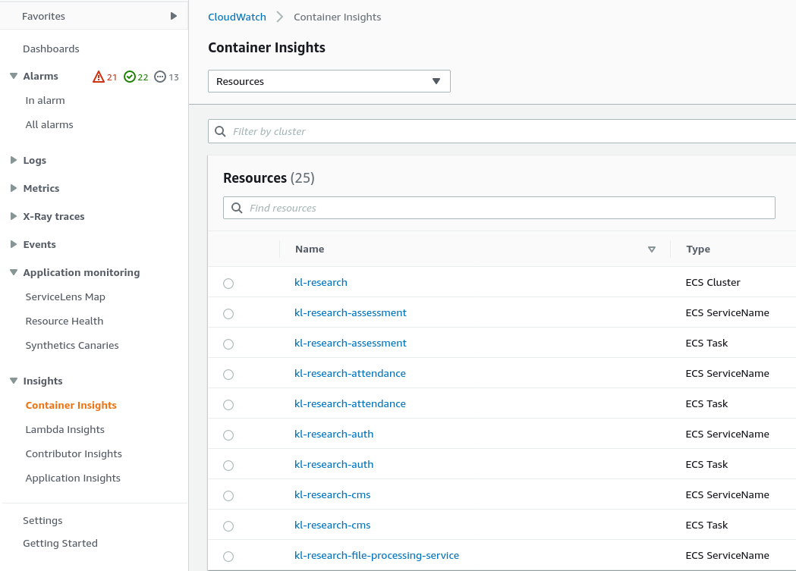
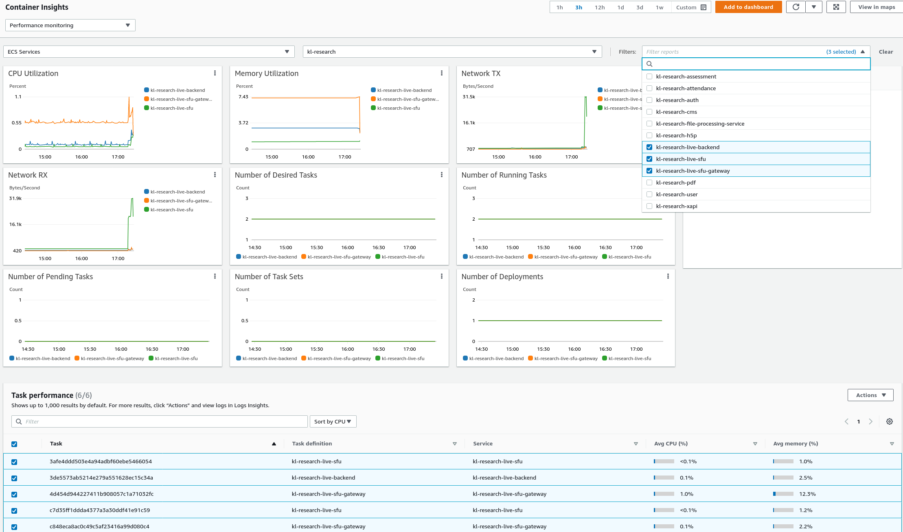
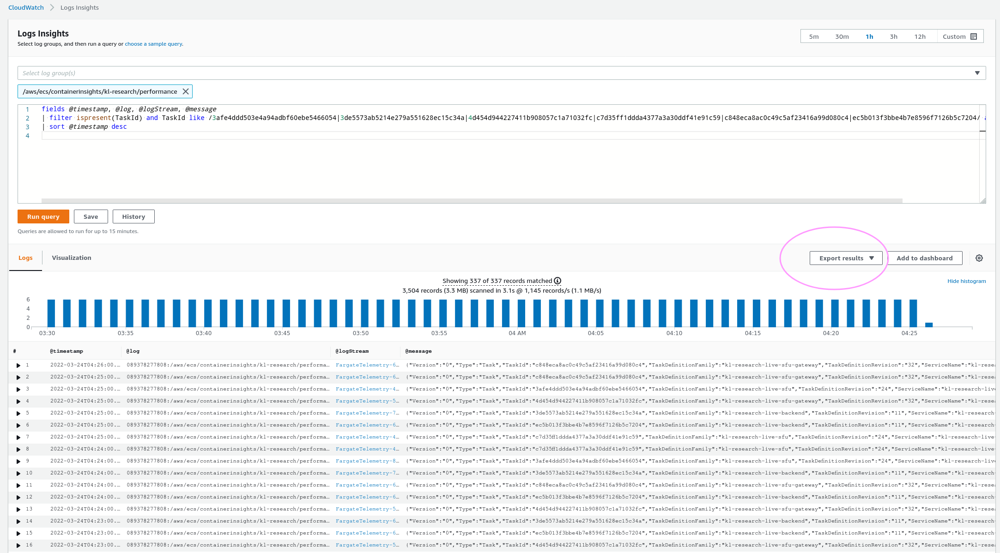

# sfu2-cw-redis-metric

## Why 

In order to match cloudwatch container insight logs with Redis logs we try and combine them.
We want to see individual container stats which is only available from cloudwatch container insights. 


## How 

Pass in your cloudwatch log insights csv along with the redis stats csv.  
You will also need to pass in the your aws profile and the name of the ecs cluster.  
Ideally you will run this as soon as you have your application and redis csv files ready, 
as redis stores and container DNS private name and cloudwatch stores the container task id, we query running ecs tasks to match DNS names to task ids. 
If these tasks are no longer running the DNS name will be blank and we won't be able to match it to a redis log.


`python main.py -r redis_metrics-20220322.csv -a app_perf_logs-20220322.csv -p kl-research-global -c kl-research`

example output. 

```
Datetime,producers,consumers,TaskId,ServiceName,ClusterName,AvailabilityZone,Timestamp,CpuUtilized,CpuReserved,MemoryUtilized,MemoryReserved,NetworkRxBytes,NetworkRxDropped,NetworkRxErrors,NetworkRxPackets,NetworkTxBytes,NetworkTxDropped,
2022-03-24 06:22:00,238,646,c7d35ff1ddda4377a3a30ddf41e91c59,kl-research-live-sfu,kl-research,ap-northeast-2c,1648102920000,2006.5191145833332,4096.0,1004,8192,4054066,0,0,36205881,9142526,0,0,77567468,21.47,ip-172-19-232-62.ap-northeast-2.compute.internal,2022-03-24 06:21:35

```

### cloudwatch log insights (csv)

Gather cloudwatch container insight logs. 

Navigate to cloudwatch container insights and click on your service in the list.  


On the next page select the filters drop down and select more services if needed.  
Select all tasks from the bottom section "Task performance". And click "action" then select "performance logs"  



Of course if you already know the task ids you want to inspect you can skip the above two steps and go straight to log insights. 


Edit the query as you need to, along with the time frame you need. Then click export results and either save of copy the CSV to the clipboard.


example output 

```
@timestamp,@log,@logStream,@message
2022-03-22 08:19:00.000,089378277808:/aws/ecs/containerinsights/kl-research/performance,FargateTelemetry-5520,"{""Version"":""0"",""Type"":""Task"",""TaskId"":""5d1298c3d5144781b27db628c7f84b61"",""TaskDefinitionFamily"":""kl-research-live-sfu"",""TaskDefinitionRevision"":""24"",""ServiceName"":""kl-research-live-sfu"",""ClusterName"":""kl-research"",""AccountID"":""089378277808"",""Region"":""ap-northeast-2"",""AvailabilityZone"":""ap-northeast-2b"",""KnownStatus"":""RUNNING"",""LaunchType"":""FARGATE"",""PullStartedAt"":1647501779189,""PullStoppedAt"":1647501805375,""CreatedAt"":1647501764909,""StartedAt"":1647501811372,""Timestamp"":1647937140000,""CpuUtilized"":4065.1211458333332,""CpuReserved"":4096.0,""MemoryUtilized"":6028,""MemoryReserved"":8192,""StorageReadBytes"":0,""StorageWriteBytes"":0,""NetworkRxBytes"":31568375,""NetworkRxDropped"":0,""NetworkRxErrors"":0,""NetworkRxPackets"":273881190,""NetworkTxBytes"":277121063,""NetworkTxDropped"":0,""NetworkTxErrors"":0,""NetworkTxPackets"":1590063599,""EphemeralStorageReserved"":21.47,""CloudWatchMetrics"":[{""Namespace"":""ECS/ContainerInsights"",""Metrics"":[{""Name"":""CpuUtilized"",""Unit"":""None""},{""Name"":""CpuReserved"",""Unit"":""None""},{""Name"":""MemoryUtilized"",""Unit"":""Megabytes""},{""Name"":""MemoryReserved"",""Unit"":""Megabytes""},{""Name"":""StorageReadBytes"",""Unit"":""Bytes/Second""},{""Name"":""StorageWriteBytes"",""Unit"":""Bytes/Second""},{""Name"":""NetworkRxBytes"",""Unit"":""Bytes/Second""},{""Name"":""NetworkTxBytes"",""Unit"":""Bytes/Second""},{""Name"":""EphemeralStorageReserved"",""Unit"":""Gigabytes""}],""Dimensions"":[[""ClusterName""],[""ServiceName"",""ClusterName""],[""ClusterName"",""TaskDefinitionFamily""]]}]}"
```

### Redis stats 

From a host with connectivity to the redis host run the script `redis-sfu-status.sh`   
Note: run this before you want to gather stats as it is gathering them live. 

example output. 

```
timestamp,instance,producers,consumers
1648097889181,ip-172-19-232-62.ap-northeast-2.compute.internal,2,4
1648097889650,ip-172-19-218-74.ap-northeast-2.compute.internal,4,8
````

